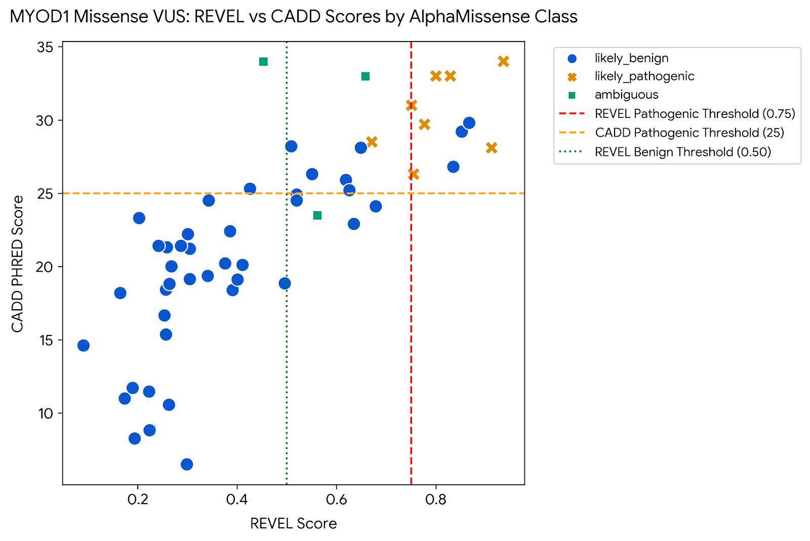
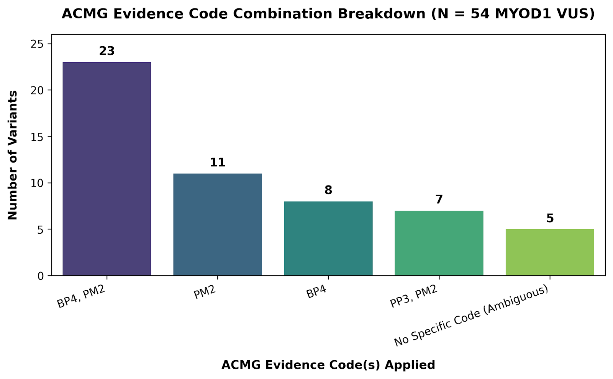

# In Silico Evidence Curation and Pathogenicity Reclassification of MYOD1 Variants of Uncertain Significance in Rhabdomyosarcoma

**Author:** Shravani Vijay Zagade  
**Affiliation:** Manipal Institute of Regenerative Medicine (MIRM), Manipal Academy of Higher Education (MAHE), Bengaluru, India  
**Contact:** zshravani818@gmail.com | [LinkedIn Profile](https://www.linkedin.com/in/shravani-zagade-29249b262/)

---

## Abstract
In pediatric oncogenes, missense Variants of Uncertain Significance (VUS) pose a major challenge in clinical genetics and cancer predisposition screening. *MYOD1* encodes a master basic helix-loop-helix (bHLH) transcription factor vital for myogenic differentiation, and specific alterations are key drivers in embryonal and sclerosing/spindle cell Rhabdomyosarcoma (RMS). For this study, 54 germline missense VUS entries for *MYOD1* were extracted from NCBI ClinVar and batch annotated using Ensembl VEP. Cross-referencing allele frequencies against gnomAD exomes (v4) and in-silico pathogenicity meta-predictors (REVEL, CADD PHRED, and AlphaMissense) were integrated according to the ACMG/AMP variant interpretation framework. 

**Key Findings:**
* **57.4% (31/54 variants)** demonstrated benign-leaning predictions (`BP4, PM2`).
* **13.0% (7/54 variants)** exhibited strong, concordant in-silico pathogenicity (`PP3, PM2`).
* **29.6% (16/54 variants)** remained ambiguous or exhibited intermediate scores.

This systematic in-silico evidence curation effectively stratifies *MYOD1* VUS entries, prioritizing specific deleterious candidates for downstream wet-lab validation in Rhabdomyosarcoma models.

---

## 1. Introduction
Rhabdomyosarcoma (RMS) is a pediatric soft tissue sarcoma with four major subtypes recognized by the WHO: embryonal RMS (ERMS), alveolar RMS (ARMS), pleomorphic RMS (PRMS), and sclerosing/spindle RMS. While ERMS and ARMS are observed in most patients, ERMS is the most common subtype. ARMS is predominantly driven by chimeric fusion genes (*PAX3/7-FOXO1*), whereas ERMS frequently harbors single-nucleotide variants in key myogenic regulators and oncogenic pathways [1].

Myogenic Differentiation 1 (*MYOD1*) encodes a master basic helix-loop-helix (bHLH) transcription factor that orchestrates muscle cell lineage commitment and differentiation by binding to canonical E-box consensus sequences (`5'-CANNTG-3'`). The myogenic differentiation 1 gene (*MYOD1*) `p.L122R` mutation acts as a blockage for cell differentiation [2]. However, many of the missense variants across the *MYOD1* gene are currently classified in ClinVar as Variants of Uncertain Significance (VUS). When clinical geneticists encounter a VUS, it cannot be used to guide diagnosis or risk assessment [3]. Reducing this burden of uncertainty through systematic in-silico curation and evidence synthesis is an essential first step toward candidate prioritization and clinical utility [4].

---

## 2. Methods

1. **Variant Retrieval:** All 54 germline missense VUS entries listed for *MYOD1* were downloaded in TSV format from NCBI ClinVar (Assembly GRCh38) [5], [6].
2. **Batch Annotation via Ensembl VEP:** Cleaned HGVS transcript strings (`NM_002478.5`) were processed through Ensembl Variant Effect Predictor (VEP) to retrieve [6]:
   * Ensemble pathogenicity scores via **REVEL** and **CADD PHRED**
   * Deep-learning predictions via **AlphaMissense** (*likely_pathogenic*, *likely_benign*, or *ambiguous*)
   * Population allele frequencies via **gnomAD exomes v4** (`gnomADe_AF`)
   * Standard reference predictors: **SIFT** and **PolyPhen-2**
3. **Canonical Transcript Filtering:** Output records were filtered for the MANE Select canonical transcript `NM_002478.5` (`ENST00000250003.4`) to ensure one consistent annotation per variant.
4. **ACMG/AMP Evidence Rules Applied:**
   * **`PP3` (Supporting Pathogenic):** Applied if REVEL $\ge 0.75$, CADD PHRED $\ge 25.0$, AND AlphaMissense = *likely_pathogenic*.
   * **`BP4` (Supporting Benign):** Applied if REVEL $< 0.50$ AND AlphaMissense = *likely_benign*.
   * **`PM2` (Supporting Pathogenic):** Applied if the variant was absent or extremely rare in gnomAD ($AF < 0.000015$) [6], [7].

---

## 3. Results & Visualizations

### 3.1 High-Priority Pathogenic Candidates
Systematic batch annotation and filtering of all 54 germline missense VUS in *MYOD1* revealed a distinct, bimodal distribution of computational pathogenicity signals. 

A total of **7 variants** met all criteria for strong in-silico pathogenicity (**`PP3, PM2`**). These entries have high REVEL scores ($\ge 0.751$), elevated CADD scores ($\ge 26.3$), and unanimous *likely_pathogenic* classification by AlphaMissense:

| Variant Notation | Protein Change | REVEL | CADD PHRED | AlphaMissense | gnomADe AF | ACMG Evidence |
| :--- | :---: | :---: | :---: | :---: | :---: | :---: |
| `NM_002478.5:c.116A>G` | **p.Asp39Gly** | 0.751 | 31.00 | `likely_pathogenic` | $4.1 \times 10^{-6}$ | **`PP3, PM2`** |
| `NM_002478.5:c.248C>A` | **p.Ala83Glu** | 0.800 | 33.00 | `likely_pathogenic` | $2.1 \times 10^{-6}$ | **`PP3, PM2`** |
| `NM_002478.5:c.278G>A` | **p.Cys93Tyr** | 0.936 | 34.00 | `likely_pathogenic` | *Absent* | **`PP3, PM2`** |
| `NM_002478.5:c.327C>A` | **p.Asp109Glu** | 0.755 | 26.30 | `likely_pathogenic` | $2.1 \times 10^{-6}$ | **`PP3, PM2`** |
| `NM_002478.5:c.469A>G` | **p.Ile157Val** | 0.912 | 28.10 | `likely_pathogenic` | $1.2 \times 10^{-5}$ | **`PP3, PM2`** |
| `NM_002478.5:c.590C>T` | **p.Ser197Phe** | 0.777 | 29.70 | `likely_pathogenic` | $3.6 \times 10^{-6}$ | **`PP3, PM2`** |
| `NM_002478.5:c.611C>G` | **p.Ser204Cys** | 0.829 | 33.00 | `likely_pathogenic` | $1.5 \times 10^{-5}$ | **`PP3, PM2`** |

Conversely, **31 out of 54 variants (57.4%)** met the criteria for benign-leaning classification (**`BP4, PM2`**). The remaining 16 variants represented intermediate or ambiguous categories: **11 variants (20.4%)** triggered `PM2` alone, and **5 variants (9.3%)** exhibited conflicting or intermediate outputs without consensus from AlphaMissense (ambiguous / No Code).

### 3.2 Predictor Concordance and Visualizations

  
**Figure 1:** *Scatter plot of REVEL vs. CADD PHRED scores for 54 MYOD1 missense VUS categorized by AlphaMissense predictions. The upper-right quadrant isolates candidates exceeding both REVEL ($\ge 0.75$) and CADD ($\ge 25$) pathogenic thresholds.*

  
**Figure 2:** *Distribution of ACMG evidence code combinations across the curated 54 MYOD1 missense variants.*

---

## 4. Discussion & Limitations

### 4.1 Biological Significance
This study successfully prioritized 7 missense variants in *MYOD1* that exhibit strong computational signals of damaging protein function. These mutations lie within or adjacent to critical structural domains of MYOD1, including the transactivation domain and the bHLH DNA-binding core. Conversely, over half of the ClinVar VUS entries (31 variants) met benign-leaning criteria (`BP4, PM2`), indicating that current clinical uncertainty for these specific variants may be driven by a lack of literature reports rather than actual functional disruption.

### 4.2 Limitations & Future Directions
Computational algorithms are evidence lines, not definitive proof. Studies indicate that ~11% of known benign variants can be falsely flagged as damaging by ensemble algorithms. In-silico evidence (`PP3`/`BP4`) alone cannot reclassify a VUS to Pathogenic or Benign in a clinical setting [6]. The 7 high-priority variants identified here require experimental testing, such as:
* **Electrophoretic Mobility Shift Assays (EMSA)** to test DNA binding capacity [8].
* **Luciferase Reporter Assays** in myogenic cell lines (e.g., C2C12 or RMS lines) to measure transactivation efficiency [8].
* **Myogenic Differentiation Assays** evaluating muscle-specific marker expression (e.g., Myogenin, MHC) [9].

---

## References
* **[1]** A. Zarrabi et al., “Rhabdomyosarcoma: Current Therapy, Challenges, and Future Approaches to Treatment Strategies,” Sep. 2023, doi: 10.20944/preprints202309.0846.v1.
* **[2]** D. Di Carlo et al., “Biological Role and Clinical Implications of MYOD1L122R Mutation in Rhabdomyosarcoma,” *Cancers (Basel)*, vol. 15, no. 6, p. 1644, Mar. 2023, doi: 10.3390/cancers15061644.
* **[3]** S. Richards et al., “Standards and guidelines for the interpretation of sequence variants: a joint consensus recommendation of the American College of Medical Genetics and Genomics and the Association for Molecular Pathology,” *Genet Med*, vol. 17, no. 5, pp. 405–424, May 2015, doi: 10.1038/gim.2015.30.
* **[4]** L.-N. Veilleux and F. Rauch, “Muscle-Bone Interactions in Pediatric Bone Diseases,” *Curr Osteoporos Rep*, vol. 15, no. 5, pp. 425–432, Oct. 2017, doi: 10.1007/s11914-017-0396-6.
* **[5]** M. J. Landrum et al., “ClinVar: improvements to accessing data,” *Nucleic Acids Res*, vol. 48, no. D1, pp. D835–D844, Jan. 2020, doi: 10.1093/nar/gkz972.
* **[6]** V. Pejaver et al., “Calibration of computational tools for missense variant pathogenicity classification and ClinGen recommendations for PP3/BP4 criteria,” *Am J Hum Genet*, vol. 109, no. 12, pp. 2163–2177, Dec. 2022, doi: 10.1016/j.ajhg.2022.10.013.
* **[7]** S. Richards et al., “Standards and guidelines for the interpretation of sequence variants: a joint consensus recommendation of the American College of Medical Genetics and Genomics and the Association for Molecular Pathology,” *Genet Med*, vol. 17, no. 5, pp. 405–424, May 2015, doi: 10.1038/gim.2015.30.
* **[8]** H. Weintraub, “The MyoD family and myogenesis: redundancy, networks, and thresholds,” *Cell*, vol. 75, no. 7, pp. 1241–1244, Dec. 1993, doi: 10.1016/0092-8674(93)90610-3.
* **[9]** N. P. Agaram et al., “MYOD1-mutant spindle cell and sclerosing rhabdomyosarcoma: an aggressive subtype irrespective of age. A reappraisal for molecular classification and risk stratification,” *Mod Pathol*, vol. 32, no. 1, pp. 27–36, Jan. 2019, doi: 10.1038/s41379-018-0120-9.
